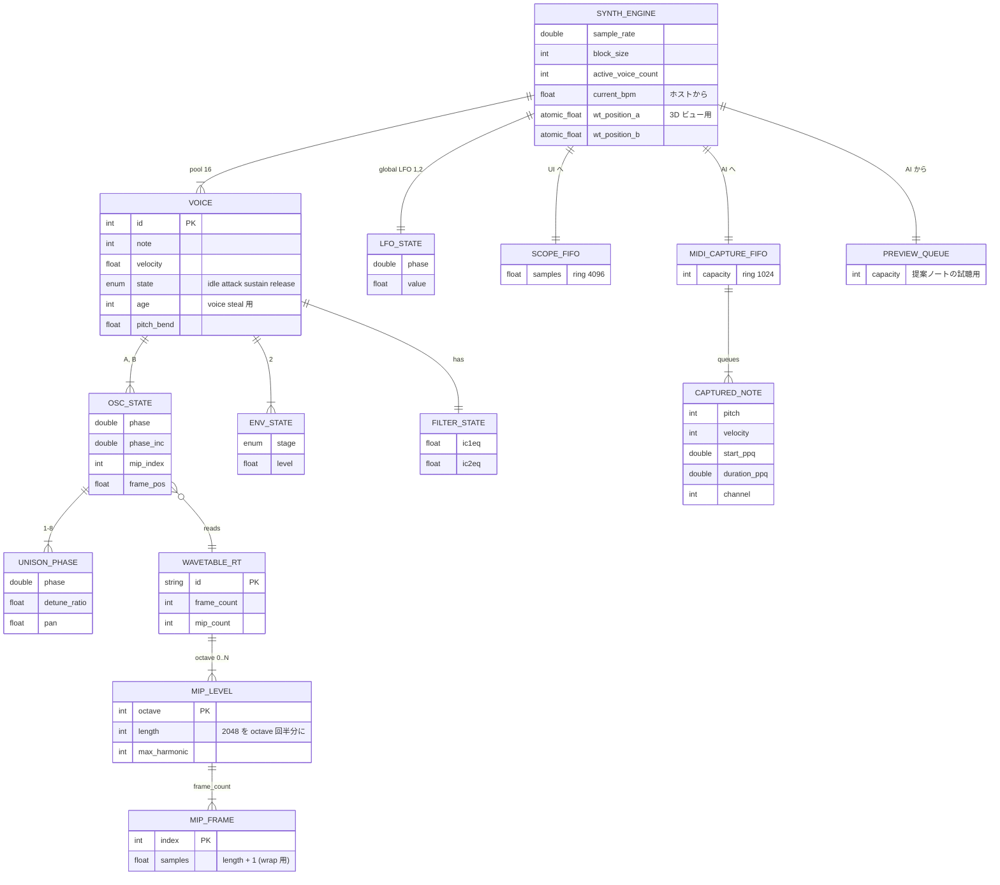
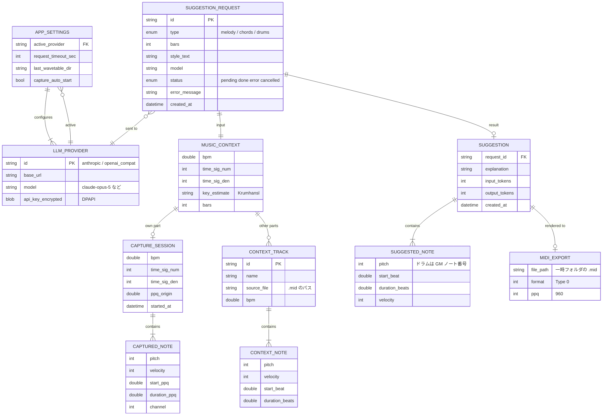

# WaveForge E-R 図

DB は使わないが、プラグインが扱うデータを 3 つの層に分けて定義する。

| 層 | 保存先 | 寿命 |
|---|---|---|
| A. プリセット状態 | APVTS (Studio One のソング / プリセット .xml) | ソングと共に保存・復元 |
| B. 実行時データ | メモリのみ | プラグイン起動中のみ |
| C. AI・アプリ設定 | `%APPDATA%\WaveForge\settings.json`、一時フォルダ (.mid) | ユーザー環境ごと |

---

## A. プリセット状態 (APVTS に保存)

```mermaid
erDiagram
    PRESET ||--|| GLOBAL : has
    PRESET ||--|{ OSCILLATOR : "has 2 (A, B)"
    PRESET ||--|| SUB_OSC : has
    PRESET ||--|| NOISE_OSC : has
    PRESET ||--|| FILTER : has
    PRESET ||--|{ ENVELOPE : "has 2"
    PRESET ||--|{ LFO : "has 2"
    PRESET ||--|{ MOD_SLOT : "has 8"
    PRESET ||--|{ FX_UNIT : "has 5"
    OSCILLATOR }o--|| WAVETABLE : "uses"
    WAVETABLE ||--|{ WT_FRAME : "contains"
    OSCILLATOR ||--|| UNISON : has
    MOD_SLOT }o--|| MOD_SOURCE : "source"
    MOD_SLOT }o--|| MOD_DEST : "destination"
    FX_UNIT ||--o| DISTORTION : "is-a"
    FX_UNIT ||--o| EQ3 : "is-a"
    FX_UNIT ||--o| CHORUS : "is-a"
    FX_UNIT ||--o| DELAY : "is-a"
    FX_UNIT ||--o| REVERB : "is-a"

    PRESET {
        string name
        string author
        string category
        int schema_version
    }
    GLOBAL {
        float master_volume_db
        int polyphony "1-16"
        int pitch_bend_range "semitones 1-24"
        float portamento_ms
        enum voice_mode "poly / mono / legato"
    }
    OSCILLATOR {
        enum id PK "A / B"
        bool enabled
        string wavetable_id FK
        float wt_position "0-1"
        int octave
        int semitone
        float fine_cents
        float level
        float pan
        float phase
        bool random_phase
        enum warp_mode "A のみ: off / fm_b / rm_b / am_b"
        float warp_amount "A のみ: 0-1"
    }
    UNISON {
        enum osc_id FK "A / B"
        int voices "1-8"
        float detune_cents
        float blend
        float stereo_width
    }
    WAVETABLE {
        string id PK
        string name
        enum source "builtin / file / user (エディタで作成、file と同じ扱い)"
        string file_path "file / user のとき (user は %APPDATA%/WaveForge/Wavetables)"
        int frame_count "1-256"
        int frame_size "2048 固定"
    }
    WT_FRAME {
        string wavetable_id FK
        int index PK
        float samples "frame_size 個"
    }
    SUB_OSC {
        bool enabled
        enum shape "sine / tri / saw / square"
        int octave "-2..0"
        float level
        bool direct_out "フィルターをバイパス"
    }
    NOISE_OSC {
        bool enabled
        enum type "white / pink"
        float level
        float pitch
    }
    FILTER {
        bool enabled
        enum type "LP12 LP24 HP12 HP24 BP12"
        float cutoff_hz
        float resonance
        float drive
        float key_track
        bool route_osc_a
        bool route_osc_b
        bool route_sub
        bool route_noise
    }
    ENVELOPE {
        int id PK "1=Amp 2=Mod"
        float attack_ms
        float decay_ms
        float sustain
        float release_ms
        float curve
    }
    LFO {
        int id PK "1 / 2"
        enum shape "sine tri saw square sh"
        bool tempo_sync
        float rate_hz
        enum sync_division "1/1 .. 1/32"
        enum trigger "free / retrig"
        float phase
    }
    MOD_SLOT {
        int index PK "0-7"
        bool enabled
        string source_id FK
        string dest_id FK
        float amount "-1..1"
        bool bipolar
    }
    MOD_SOURCE {
        string id PK "env1 env2 lfo1 lfo2 velocity modwheel aftertouch keytrack"
    }
    MOD_DEST {
        string id PK "パラメータ ID (osc_a_wt_pos, filter_cutoff ...)"
    }
    FX_UNIT {
        enum type PK "distortion eq chorus delay reverb"
        bool enabled
        int order "固定順 0-4"
        float mix "EQ には無い (帯域ごとの gain で代用)"
    }
    DISTORTION {
        enum mode "soft / hard / fold"
        float drive_db "0-40"
        bool oversample_2x
        float output_db "-24..6 (wet のみ)"
    }
    EQ3 {
        float low_gain_db
        float low_freq
        float mid_gain_db
        float mid_freq
        float mid_q
        float high_gain_db
        float high_freq
    }
    CHORUS {
        float rate_hz
        float depth
        float feedback
        float delay_ms
    }
    DELAY {
        bool tempo_sync
        float time_ms
        enum division
        float feedback
        float lowpass_hz
        bool ping_pong
    }
    REVERB {
        float size
        float damping
        float width
        float predelay_ms
    }
```

---

## B. 実行時データ (メモリのみ)

---

## C. AI アシスタント・アプリ設定

---

## 補足

- **A 層** のパラメータは全て `Params.h` の APVTS パラメータ ID に 1:1 対応させる。`WAVETABLE` は `.wav` のパスと `builtin` 名のみ保存し、`WT_FRAME` のサンプルデータは保存しない (読込時に再生成)。
- **B 層** の `MIP_LEVEL` / `MIP_FRAME` は `WAVETABLE` からロード時に FFT で派生させる (永続化しない)。
- **C 層** の `api_key_encrypted` は Windows DPAPI で暗号化し、ソング (A 層) には絶対に含めない。
- `CAPTURED_NOTE` は B 層のロックフリー FIFO から C 層の `CAPTURE_SESSION` へメッセージスレッドで移す。
